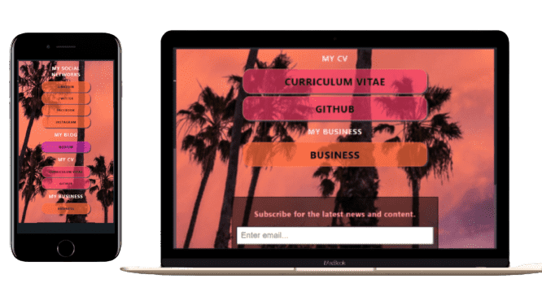

<h1 align="center">

Link Tree Landing Page

</h1>

A Link Tree landing page where you can display all your links on one decentralized website. There is also a small 'subscribe' form at the bottom of the page.

## Features

>*These are the default links. Add/Change them to your preferences*

- **Profile-Pic**
- **Social Links**
  - Linkedin
  - Facebook
  - Twitter
  - Instagram
  - Telegram
- **My Blog**
  - Medium
- **My CV**
  - CV
  - Github
- **My Business**
  - Business
- **Subscribe Form**
(You will need to add an action endpoint)

### Screenshot 

#### Tools 

>*Save space by optimizing your images first.*

- I resized the images with [Image Resizer](https://imageresizer.com/).
- I used [Image Compresspor](https://imageresizer.com/image-compressor) to compress the images.
- I got the background image at [Canva.com](https://canva.com)

